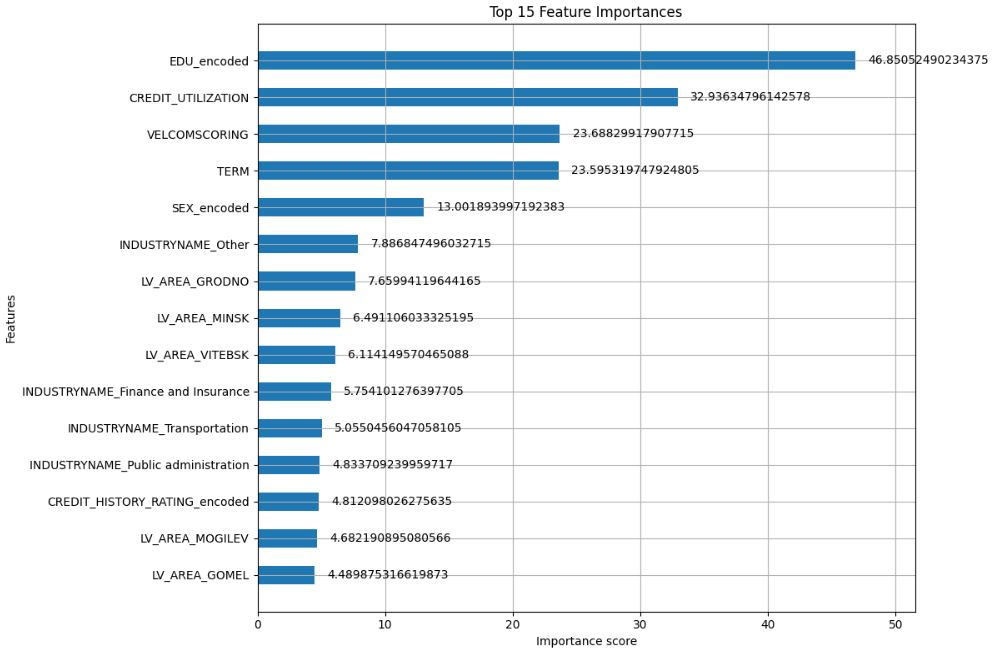
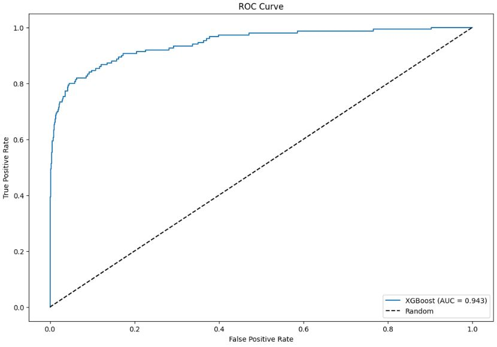
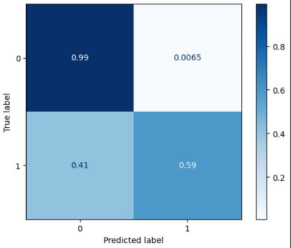

# Credit Default Prediction – XGBoost & Power BI Dashboard 📊

This project tackles the challenge of predicting **loan defaults** — a critical task in financial risk assessment.  
It combines a **machine learning model (XGBoost with SMOTE)** to handle imbalanced data and a **Power BI dashboard** to provide actionable insights for stakeholders.

We trained a model to **classify clients based on the likelihood of defaulting on a loan**, using engineered features from financial and behavioral data.  
The model outputs a probability score for each client, allowing threshold-based decisions and prioritization of high-risk cases.

---

## 🚀 Project Highlights

### **1. Machine Learning Pipeline**
- **Data Preprocessing**  
  - Smart null value imputation using **Gemini API**
  - Feature scaling and encoding  
  - Train-test split with stratification

- **Class Imbalance Solution**  
  - **SMOTE (Synthetic Minority Oversampling Technique)** applied on the training set

- **Model Training & Tuning**  
  - **XGBoost Classifier**  
  - **Hyperparameter tuning** via `GridSearchCV`:
    - `max_depth`, `n_estimators`, `learning_rate`, `subsample`, `colsample_bytree`
  - **Threshold optimization** to balance **recall** and **precision** for the minority class (defaults)

- **Model Performance (Test Set)**  
  - **ROC AUC**: 0.9361  
  - **Default Class Precision**: 0.81  
  - **Default Class Recall**: 0.61  
  - **F1-score**: 0.69  
---

## 📊 Visualizations

Here are some key visualizations from the model training and validation process:

| Important Features | ROC Curve | Confusion matrix |
|----------------|--------------------|-------------------------|
|  |  |  |

These visualizations provide insight into:
- **Most influential features** in the model, helping interpret predictions and feature importance.
- **ROC Curve**, showing the trade-off between true positive rate and false positive rate.
- **Confusion Matrix**, visualizing classification performance and the balance between correctly and incorrectly predicted classes.

---

> These metrics highlight the trade-off between precision and recall in imbalanced datasets, ensuring that more defaults are correctly identified (high recall), even if it means a few false positives. Despite the model achieving high overall performance, the recall and F1-score for the default class (1) are naturally lower compared to the non-default class (0). This is expected due to the strong class imbalance in the original dataset, where only about 4% of the records represent defaults. In the context of bank credit risk assessment, this imbalance is common — most clients repay their loans on time, while only a small fraction default. Even after applying SMOTE to balance the training data, perfect detection of the minority class remains challenging. However, the model still performs well, achieving a recall of 60% and precision of 81% for the default class, which is a solid result in financial applications where predicting defaults is more critical than achieving perfect accuracy.

---

### **2. Business Intelligence Dashboard (Power BI)**

To complement the ML results, an interactive **Power BI dashboard** was built for stakeholders to monitor portfolio health.

#### **Dashboard Features**
- **KPIs:**
  - High Risk Client Rate
  - Overdue Client Rate
  - Average PDN (Probability of Default)
  - Number of Clients
- **Visuals:**
  - Risk Category breakdown by Age Group, and risk level.
  - Income analysis by Age Group and Education Level
  - Client demographics by Gender and Education Level
  - Geographic analysis by Region
- **Interactive Filters (Slicers):**
  - AgeGroup, RiskCategory, Region

🔗 **[View the Interactive Power BI Report](PUT-YOUR-POWER-BI-PUBLIC-LINK-HERE)**

---

## 📊 Dataset
- **Source:** [Kaggle Dataset](https://lnkd.in/eZwZ4P5y)
- Contains financial attributes like `DEBT`, `OVERDUE_DAYS`, `INITIAL_LIMIT`, `INCOME`, `AGE`, `PDN`, and more.

---

## 🛠️ Technologies Used
- **Python:** pandas, numpy, scikit-learn, XGBoost, imbalanced-learn
- **Visualization:** matplotlib, seaborn
- **Business Intelligence:** Power BI
- **Notebook:** Kaggle, Jupyter

---

## 📎 Additional Links
- [Kaggle Notebook](https://lnkd.in/e92xcVWQ)  
- [Dataset](https://lnkd.in/eZwZ4P5y)  

---

## ✨ Key Takeaways
- Demonstrates a complete end-to-end **data science workflow** from preprocessing to dashboarding.
- Shows how to handle **imbalanced datasets** using SMOTE.
- Highlights the importance of **recall in financial risk detection**.
- Integrates **Power BI for business-friendly visualization** of the results.

---

## 👤 Author
**Bouchentouf Othman**  
[LinkedIn](https://www.linkedin.com/in/othman-bouchentouf/)
